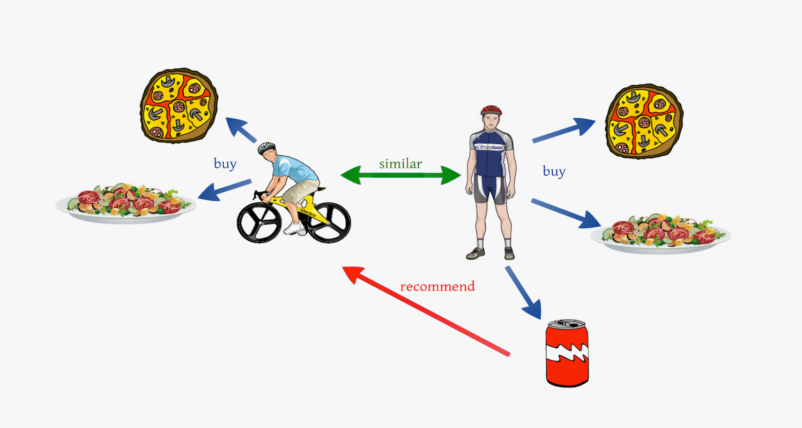

# Data Analysis and Anime Recommendation System

## Project Description
This project focuses on the study of an anime dataset and building a recommendation system based on collaborative filtering (Collaborative Filtering). The main goal is to analyze data, identify patterns, and provide users with personalized recommendations for anime content.

The dataset contains over 109 million rows, providing extensive insights into user preferences and behaviors.

## Key Stages of the Project:

### Exploratory Data Analysis (EDA)

During this stage, we conducted the following steps:

* Initial overview of the structure and types of data.
* Detection and handling of missing values.
* Identification of anomalies and outliers.
* Examination of distributions of key variables (such as ratings, genres, number of episodes).
* Creation of visualizations to understand relationships between parameters.

### Recommendation System

To build recommendations, we applied the technique of Collaborative Filtering. This method takes into account interactions between users and content. It considers the preferences of other users whose tastes are similar to those of the current user and suggests new anime that aligns with these preferences.

─

The project represents a comprehensive research effort aimed at enhancing user interaction with anime platforms by offering personalized recommendations.

## Dependencies and description of project files

The notebook with all stages of the project can be found [here](https://github.com/esta1d/Anime_Recommendation_System/blob/main/DS_fn.ipynb)

***Python 11.x***
[***library versions***](https://github.com/esta1d/Anime_Recommendation_System/blob/main/requirements.txt)